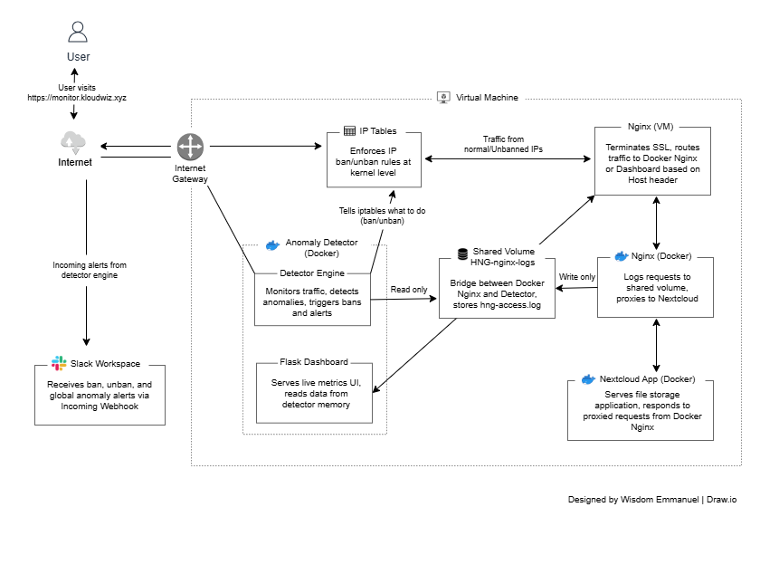

# HNG14 Stage 3 — Anomaly Detection Engine / DDOS Detection Tool

A real-time DDoS and anomaly detection daemon built for HNG14 Stage 3. Monitors Nginx HTTP traffic, learns normal traffic patterns, and automatically blocks suspicious IPs via iptables.

## Live URLs
- **Metrics Dashboard:** https://monitor.kloudwiz.xyz
- **Server IP:** 35.210.112.223 (Nextcloud accessible via IP only)

## GitHub Repository
https://github.com/kloud-wiz/hng14-stage3-anomaly-detector

## Blog Post
<!-- Add Hashnode URL coming soon -->

---

## Architecture



---

## Language Choice
Built in **Python** because:
- Rich standard library (collections.deque, threading, statistics)
- Excellent ecosystem for this use case (Flask, psutil, requests)
- Faster iteration and debugging during development
- Most DevOps tooling is Python-first

---

## How the Sliding Window Works

Two deque-based windows track request rates:

**Per-IP window:** Every request from an IP appends a timestamp to that IP's deque. On every request, entries older than 60 seconds are evicted from the left:

```python
while self.ip_windows[ip] and self.ip_windows[ip][0] < cutoff:
    self.ip_windows[ip].popleft()
```

The current rate is simply `len(deque) / window_seconds`.

**Global window:** Same structure but tracks all requests regardless of IP.

This gives an accurate real-time request rate without any external libraries.

---

## How the Baseline Works

- **Window size:** 30 minutes of per-second request counts
- **Recalculation interval:** Every 60 seconds
- **Per-hour slots:** Baseline prefers the current hour's data when it has enough samples (min 3), otherwise falls back to the full 30-minute rolling window
- **Floor values:** mean never drops below 1.0 req/s, stddev never below 0.5 — prevents false positives during quiet periods

---

## How Anomaly Detection Works

An IP or global rate is flagged anomalous if **either** condition fires:

1. **Z-score:** `(current_rate - baseline_mean) / baseline_stddev >= 3.0`
2. **Rate multiplier:** `current_rate >= baseline_mean * 5.0`

If an IP has a 4xx/5xx error rate 3x above baseline, thresholds are tightened by 50%.

---

## How iptables Blocking Works

When an IP is flagged:
```bash
iptables -I INPUT 1 -s <ip> -j DROP
```
- `-I INPUT 1` inserts at the top of the INPUT chain (highest priority)
- `-j DROP` silently drops all packets — attacker gets no response

Auto-unban backoff schedule:
- 1st ban: 10 minutes
- 2nd ban: 30 minutes
- 3rd ban: 2 hours
- 4th ban+: permanent

---

## Setup Instructions

### 1. Prerequisites
```bash
sudo apt update && sudo apt install -y docker.io docker-compose git
sudo usermod -aG docker $USER && newgrp docker
```

### 2. Clone the repo
```bash
git clone https://github.com/kloud-wiz/hng14-stage3-anomaly-detector.git
cd hng14-stage3-anomaly-detector
```

### 3. Configure
```bash
nano detector/config.yaml
# Set your Slack webhook URL
```

### 4. Start the stack
```bash
docker-compose up --build -d
```

### 5. Set up dashboard domain (optional)
```bash
sudo apt install -y nginx certbot python3-certbot-nginx
sudo nano /etc/nginx/sites-available/monitor
# Proxy monitor.yourdomain.com → localhost:8080
sudo certbot --nginx -d monitor.yourdomain.com
```

### 6. Verify
```bash
docker-compose ps
curl -H "X-Forwarded-For: 1.2.3.4" http://localhost:8081/
docker exec detector cat /var/log/nginx/hng-access.log
```

---

## Repository Structure
```
detector/
  main.py         # Entry point, wires all modules
  monitor.py      # Tails and parses Nginx access log
  baseline.py     # Rolling 30-min baseline tracker
  detector.py     # Z-score and anomaly detection logic
  blocker.py      # iptables ban/unban + audit logging
  unbanner.py     # Backoff unban scheduler
  notifier.py     # Slack webhook alerts
  dashboard.py    # Flask live metrics dashboard
  config.yaml     # All thresholds and settings
  requirements.txt
nginx/
  nginx.conf      # JSON access log + reverse proxy config
docs/
screenshots/
README.md
```

---

## Screenshots
- `Tool-running.png` — Daemon running, processing log lines
- `Ban-slack.png` — Slack ban notification
- `Unban-slack.png` — Slack unban notification
- `Global-alert-slack.png` — Slack global anomaly notification
- `Iptables-banned.png` — iptables showing blocked IPs
- `Audit-log.png` — Structured audit log
- `Baseline-graph.png` — Baseline mean across two hourly slots
